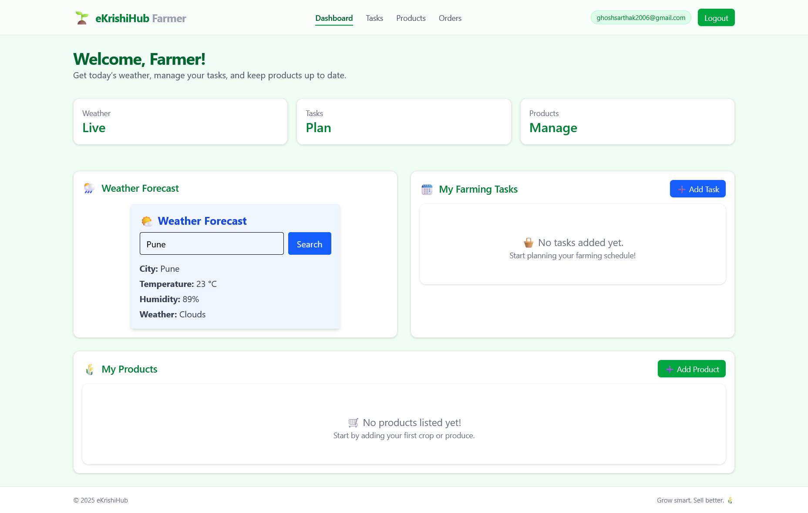
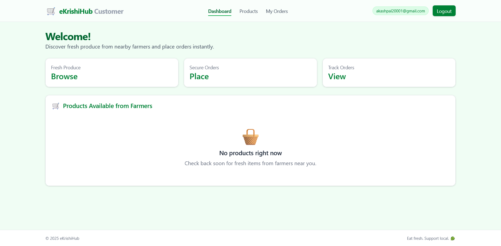

# 🌱 eKrishiHub

> A **Smart Farming Platform** built with **React (frontend)**, **Spring Boot (backend)**, and **MySQL (database)**.  
> Designed to empower farmers with tools to **sell crops, track tasks, and manage farming digitally**.  
> Secure authentication is powered by **JWT** and the project is ready to containerized with **Docker** and deployable on **AWS**.

---

## 🚀 Features

- 👩‍🌾 **Farmer Module** – Register/login, manage crops, track daily farming tasks, also able to see weather updates.  
- 🛒 **Customer Module** – Register/login, browse and order crops/products.  
- ✅ **Authentication** – Secure **JWT-based login/registration** with email OTP verification.  
- 📦 **Product Management** – Farmers can add and manage crops/products.  
- 📋 **Task Management** – Farmers can create, update, and track their farming tasks.  
- ☁️ **Deployment Ready** – Dockerized setup, optimized for AWS deployment.  
- 🗄️ **Database** – MySQL schema for structured and relational data management.

---

## 🛠️ Tech Stack

**Frontend**  
- ⚛️ React 18  
- Redux Toolkit for state management  
- Axios for API calls  
- TailwindCSS / CSS Modules for UI  

**Backend**  
- ☕ Spring Boot 3 (REST APIs)  
- Spring Security (JWT Authentication)  
- Lombok (Boilerplate reduction)  
- JPA / Hibernate (ORM)  

**Database**  
- 🐬 MySQL  

**DevOps & Deployment**  
- can be done by using 
- 🐳 Docker  
- ☁️ AWS (EC2 / RDS ready)  

---

## 📂 Project Structure

```bash
eKrishiHub/
│
├── eKrishiHub-frontend/      # React frontend
│   ├── public/               
│   ├── src/                  
│   │   ├── components/       # Reusable UI components
│   │   ├── pages/            # React Router pages (Farmer, Customer, Auth, etc.)
│   │   ├── redux/            # Redux slices (auth, products, tasks)
│   │   └── utils/            # Axios config, helpers
│   └── package.json
│
├── eKrishiHub-backend/       # Spring Boot backend
│   ├── src/main/java/com/ekrishihub/backend/
│   │   ├── config/           # Security, JWT, CORS
│   │   ├── controller/       # REST endpoints
│   │   ├── entity/           # JPA entities
│   │   ├── repository/       # Repositories
│   │   ├── service/          # Business logic
│   │   └── utils/            # Utility classes
│   ├── src/main/resources/
│   │   └── application.properties
│   └── pom.xml
│
└── README.md
```

---

## ⚙️ Setup & Installation

Follow these steps to run the project locally:

### 1️⃣ Clone the Repository
```bash
git clone https://github.com/PranavM0hite/eKrishiHub.git
cd eKrishiHub
```

---

### 2️⃣ Backend Setup (Spring Boot)

1. Go to the backend folder:
   ```bash
   cd eKrishiHub-backend
   ```

2. Create the database in MySQL:
   ```sql
   CREATE DATABASE e_krishi_hub;
   ```

3. Update `application.properties` with your MySQL credentials:
   ```properties
   spring.datasource.url=jdbc:mysql://localhost:3306/e_krishi_hub
   spring.datasource.username=your_mysql_username
   spring.datasource.password=your_mysql_password
   spring.jpa.hibernate.ddl-auto=update
   ```

4. Build and run the backend:
   ```bash
   mvn clean install
   mvn spring-boot:run
   ```

---

### 3️⃣ Frontend Setup (React)

1. Go to the frontend folder:
   ```bash
   cd eKrishiHub-frontend
   ```

2. Install dependencies:
   ```bash
   npm install
   ```

3. Start the React app:
   ```bash
   npm start
   ```

The frontend will run on [http://localhost:3000](http://localhost:3000)  
The backend will run on [http://localhost:8080](http://localhost:8080)

---

## 🔐 Authentication Flow

1. User registers → OTP is sent to email.  
2. User verifies OTP → account is activated.  
3. Login with credentials → JWT token is generated.  
4. JWT token is used for accessing secured APIs.  

---

## 📸 Screenshots (Demo)





---

## 🧑‍💻 Developer Notes

- 🐛 Contributions welcome! If you find bugs or want to add features, feel free to fork and PR.

---

## 📜 License

This project is licensed under the **MIT License** – you’re free to use, modify, and distribute.  

---

## ⭐ Support

If you like this project, give it a **star ⭐ on GitHub** – it helps a lot!
